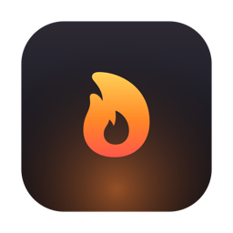
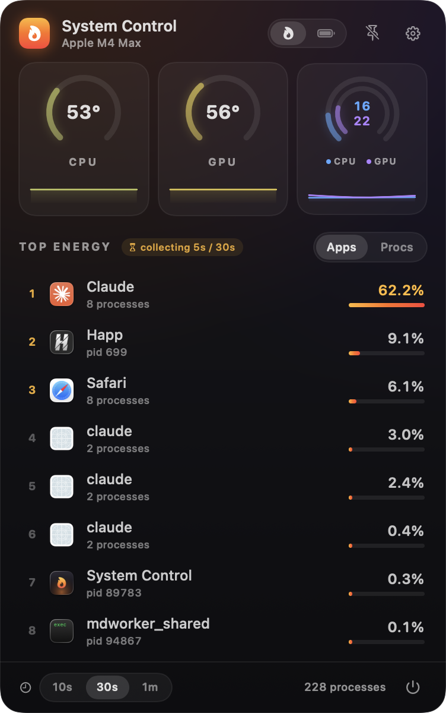
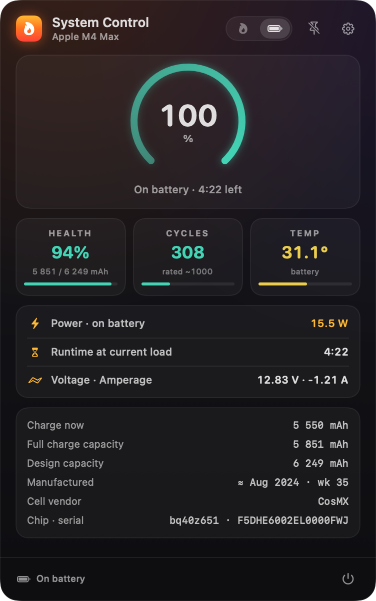

<p align="center">
  
</p>

# 🔥 System Control

*by Alex Kovalev*

[](https://github.com/ArrivaRUS/SystemControl/releases)
[](LICENSE)


**[English](#-english)** · **[Русский](#-русский)**

| Energy | Battery |
|---|---|
|  |  |

---

## 🇬🇧 English

A native macOS menu bar utility that shows **what is burning energy and heating your MacBook** — CPU/GPU temperatures, battery health — and lets you kill the culprit in one click.

### Features

- **Top energy-hungry processes and apps** — CPU usage is averaged over a selectable
  window (**10 / 30 seconds / 1 minute**, 30 s by default), so the list doesn't jump
  around like Activity Monitor: it shows what has actually been heating the machine.
- **Grouping by application** — Chrome/Safari helpers roll up under their parent app
  (just like Activity Monitor), or switch to a flat process list (Apps / Procs).
- **One-click kill** — hover a row → ✕ → `Quit` (polite terminate / SIGTERM)
  or `Force` (SIGKILL).
- **CPU & GPU temperatures** with ring gauges and history sparklines.
  The color shifts from mint (cool) to crimson (critical).
- **CPU and GPU load on one dual-ring gauge** — outer ring is CPU, inner is GPU.
- **Live status in the menu bar**: CPU temperature, and on AC power — the wattage
  drawn from the adapter (⚡96W). Each element can be switched off in settings.
- **Always-on-top mode** — 📌 pins the panel as a floating window that stays above
  all windows in every Space. Close with Esc or 📌.
- **Battery tab** — coconutBattery-style health & usage: charge, health
  (actual vs design capacity), cycle count, battery temperature, voltage and
  amperage, signed battery power, real system power draw (SMC telemetry),
  runtime estimate at the current load, power adapter details, manufacture date
  and cell vendor, serial number.
- **Launch at login**, refresh rate of 1/2/5/10 s.
- **Full thermal sensor list** (hundreds of SoC sensors) in settings.

### Download

**[SystemControl-1.2.3.dmg](https://github.com/ArrivaRUS/SystemControl/releases/latest)** —
open the image and drag `System Control` to `Applications`.

The app is ad-hoc signed (not notarized), so on first launch:
right-click the app → **Open**.

Build the DMG from source: `./build.sh && scripts/make_dmg.sh`.

### Building from source

```bash
./build.sh                                     # builds "dist/System Control.app"
cp -R "dist/System Control.app" /Applications/ # install
open "/Applications/System Control.app"
```

A flame icon appears at the top-right of the menu bar.

### How it works

| What | How |
|---|---|
| Process energy | per-process CPU time via `libproc` (`proc_pid_rusage`), deltas over a ring buffer of snapshots → average over the window |
| Grouping | `responsibility_get_pid_responsible_for_pid` — the same mechanism Activity Monitor uses |
| CPU temperature | SoC HID sensors (`IOHIDEventSystemClient`, usage page `0xff00`) — `PMU tdie*` sensors |
| GPU temperature | SMC keys `Tg*` via `AppleSMC` |
| CPU load | `host_statistics` |
| GPU load | `IOAccelerator` → `PerformanceStatistics` ("Device Utilization %") |
| Battery | `AppleSmartBattery` registry (capacities, cycles, electrical, telemetry, adapter) |

The utility itself consumes ~0.1% CPU and requires no root.

### Diagnostics

```bash
.build/release/SystemControl --probe     # all sensors + top processes to stdout
.build/release/SystemControl --snapshot  # render the panel to PNG offscreen
```

Toggle the floating panel from outside (Shortcuts / scripts):

```bash
swift -e 'import Foundation; DistributedNotificationCenter.default().postNotificationName(.init("com.arrivarus.systemcontrol.togglePanel"), object: nil, userInfo: nil, deliverImmediately: true)'
```

### Limitations

- "Energy" is measured as CPU time — the main heating factor. GPU/disk/network
  are not included (honest accounting requires root, like `powermetrics`).
- `kernel_task` is not shown (the kernel exposes no rusage to user processes).
  If that's what is heating up, it's thermal throttling — watch the temperatures.
- Thermal APIs are private (HID/SMC); sensor names are tuned for Apple Silicon
  (verified on M4 Max), with pattern-based fallbacks for other chips.
- Other users' system processes can't be killed — the utility will honestly
  say "No permission".

---

## 🇷🇺 Русский

Нативная menu bar утилита для macOS: показывает, **кто жрёт энергию и греет MacBook**, температуры CPU/GPU и здоровье батареи — и позволяет прибить виновника в один клик.

### Возможности

- **Топ энергопрожорливых процессов и приложений** — потребление CPU усредняется
  за выбранное окно (**10 / 30 секунд / 1 минута**, по умолчанию 30 секунд),
  поэтому список не прыгает, как в Activity Monitor, а показывает,
  кто реально грел машину в последнее время.
- **Группировка по приложениям** — хелперы Chrome/Safari и т.п. собираются под родительское
  приложение (как в Activity Monitor), либо режим плоского списка процессов (Apps / Procs).
- **Kill в один клик** — наведи на строку → крестик → `Quit` (вежливый terminate / SIGTERM)
  или `Force` (SIGKILL).
- **Температуры CPU и GPU** с кольцевыми гейджами и спарклайнами истории.
  Цвет меняется от мятного (прохладно) до малинового (критично).
- **Загрузка CPU и GPU на одном сдвоенном индикаторе** — внешнее кольцо CPU,
  внутреннее GPU, с общей историей.
- **Живой статус прямо в menu bar**: температура CPU, а на внешнем питании —
  мощность, потребляемая от адаптера (⚡96W). Каждый элемент отключается
  в настройках.
- **Режим "поверх всех окон"** — кнопка 📌 открепляет панель в плавающее окошко,
  которое висит над всеми окнами и во всех Spaces. Закрыть — Esc или 📌.
- **Вкладка Battery** — здоровье и использование батареи в духе coconutBattery:
  заряд, здоровье (фактическая/проектная ёмкость), циклы, температура батареи,
  напряжение и ток, мощность батареи со знаком, реальное потребление системы
  (из телеметрии SMC), прогноз времени работы при текущей нагрузке, параметры
  адаптера питания, дата производства и производитель ячеек, серийник.
- **Автозапуск при логине**, настройка частоты обновления (1/2/5/10 с).
- **Полный список термосенсоров** (сотни датчиков SoC) — в настройках.

### Скачать

**[SystemControl-1.2.3.dmg](https://github.com/ArrivaRUS/SystemControl/releases/latest)** —
открыть образ и перетащить `System Control` в `Applications`.

Приложение подписано ad-hoc (не нотаризовано), поэтому при первом запуске:
правый клик по приложению → **Открыть**.

Сборка DMG из исходников: `./build.sh && scripts/make_dmg.sh`.

### Сборка из исходников

```bash
./build.sh                                     # соберёт "dist/System Control.app"
cp -R "dist/System Control.app" /Applications/ # установить
open "/Applications/System Control.app"
```

Иконка-пламя появится в правом верхнем углу menu bar.

### Как это работает

| Что | Как |
|---|---|
| Энергия процессов | CPU-время всех процессов через `libproc` (`proc_pid_rusage`), дельты по кольцевой истории снапшотов → среднее за окно |
| Группировка | `responsibility_get_pid_responsible_for_pid` — тот же механизм, что у Activity Monitor |
| Температура CPU | HID-сенсоры SoC (`IOHIDEventSystemClient`, usage page `0xff00`) — датчики `PMU tdie*` |
| Температура GPU | SMC-ключи `Tg*` через `AppleSMC` |
| Загрузка CPU | `host_statistics` |
| Загрузка GPU | `IOAccelerator` → `PerformanceStatistics` («Device Utilization %») |
| Батарея | реестр `AppleSmartBattery` (ёмкости, циклы, электрика, телеметрия, адаптер) |

Утилита сама потребляет ~0.1% CPU и не требует root.

### Диагностика

```bash
.build/release/SystemControl --probe     # все сенсоры + топ процессов в терминал
.build/release/SystemControl --snapshot  # рендер панели в PNG без показа окна
```

Переключить плавающую панель извне (для Shortcuts / скриптов):

```bash
swift -e 'import Foundation; DistributedNotificationCenter.default().postNotificationName(.init("com.arrivarus.systemcontrol.togglePanel"), object: nil, userInfo: nil, deliverImmediately: true)'
```

### Ограничения

- «Энергия» считается по CPU-времени — основному фактору нагрева. GPU/диск/сеть
  в метрику не входят (их честный учёт требует root, как `powermetrics`).
- `kernel_task` не показывается (ядро не отдаёт rusage обычному процессу).
  Если греется именно он — это троттлинг, смотри на температуры.
- Температурные API приватные (HID/SMC) — имена датчиков подобраны под Apple Silicon
  (проверено на M4 Max); на других чипах CPU/GPU определяются паттернами с фолбэками.
- Системные процессы других пользователей убить нельзя — утилита честно скажет
  «No permission».

---

## License / Лицензия

MIT © 2026 [Alex Kovalev](https://github.com/ArrivaRUS)

*Swift + SwiftUI, no dependencies. Made with Claude. / Swift + SwiftUI, без зависимостей. Сделано с Claude.*
